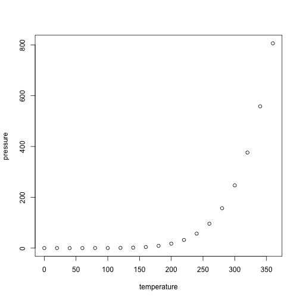

# pathwayfindR

<!-- badges: start -->
[](https://lifecycle.r-lib.org/articles/stages.html#experimental)
[](https://github.com/CogDisResLab/pathwayFindR/actions/workflows/rworkflows.yml)
[](https://github.com/CogDisResLab/pathwayFindR/releases/latest)
[](https://github.com/CogDisResLab/pathwayFindR/blob/main/LICENSE)
[](https://zenodo.org/badge/latestdoi/338354715)
[](https://app.codecov.io/gh/CogDisResLab/pathwayFindR?branch=devel)
<!-- badges: end -->

The goal of pathwayFindR is to ...

## Installation

You can install the released version of pathwayFindR from [r-universe](https://cogdisreslab.r-universe.dev/pathwayFindR) with:


``` r
install.packages("pathwayfindR",
    repos = c(
        "https://cogdisreslab.r-universe.dev",
        "https://cran.r-project.org"
    )
)
```

## Example

This is a basic example which shows you how to solve a common problem:


``` r
library(pathwayFindR)
#> Error in library(pathwayFindR): there is no package called 'pathwayFindR'
## basic example code
```

What is special about using `README.Rmd` instead of just `README.md`? You can include R chunks like so:


``` r
summary(cars)
#>      speed           dist
#>  Min.   : 4.0   Min.   :  2.00
#>  1st Qu.:12.0   1st Qu.: 26.00
#>  Median :15.0   Median : 36.00
#>  Mean   :15.4   Mean   : 42.98
#>  3rd Qu.:19.0   3rd Qu.: 56.00
#>  Max.   :25.0   Max.   :120.00
```

You'll still need to render `README.Rmd` regularly, to keep `README.md` up-to-date. `devtools::build_readme()` is handy for this.

You can also embed plots, for example:

<div class="figure">

<p class="caption">plot of chunk pressure</p>
</div>

In that case, don't forget to commit and push the resulting figure files, so they display on GitHub and CRAN.
